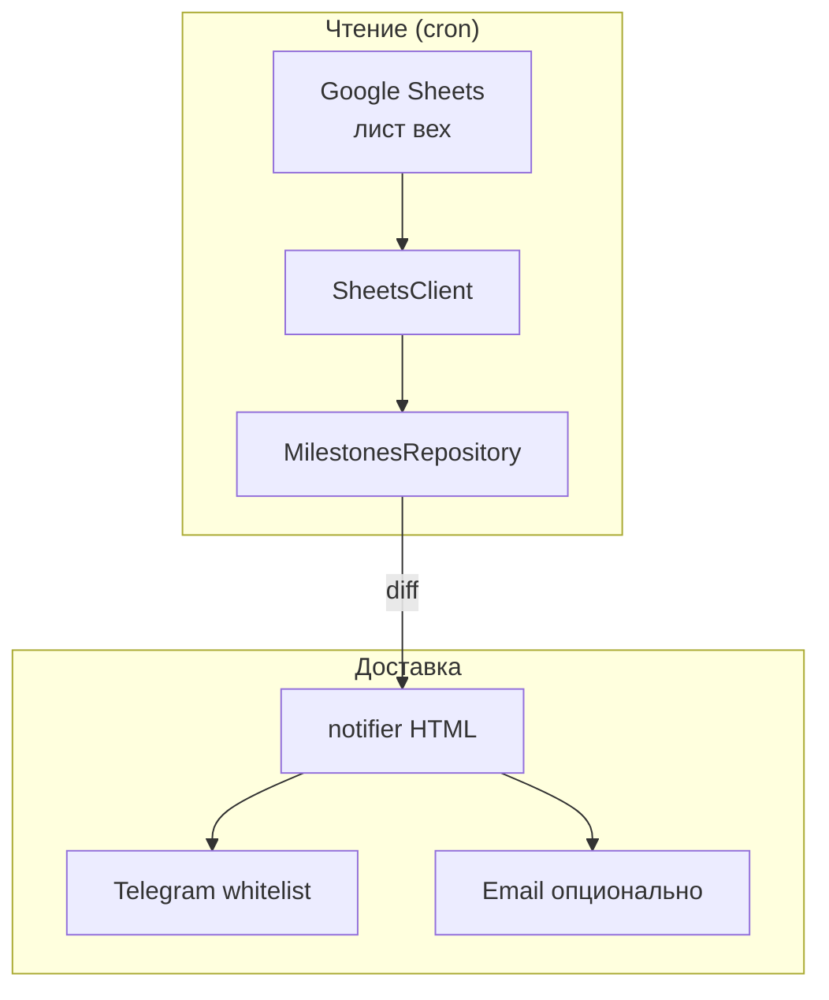
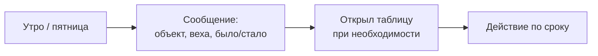
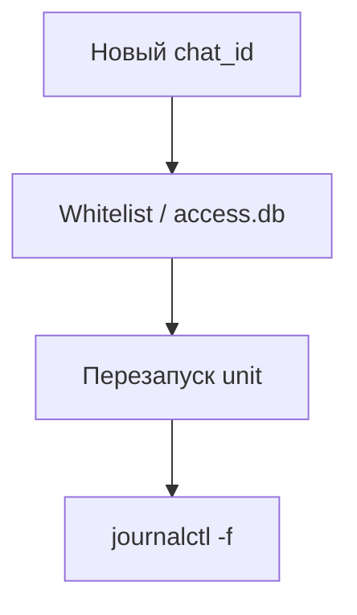

# Milestone Digest Bot — дайджесты по срокам

Короче: **diff листа вех → Telegram (и опционально email)** по расписанию, whitelist chat_id.

Задача: срок сдвинулся — узнать должны те, кому надо, а не те, кто случайно в чате. Отдельно от lookup-бота: здесь только мониторинг и рассылка.

---

## Что сделано

- **SheetsClient** — чтение диапазонов через service account.
- **MilestonesRepository** — сравнение срезов, diff по датам.
- **notifier** — HTML в Telegram; пятничный digest.
- **APScheduler** — утренние уведомления + weekly.
- **Опционально SMTP** — дубль на почту.

---

## Фишки и удобство

| Фишка | Зачем |
|-------|-------|
| Горизонты 7/14/30 дней | Не шумим о далёком будущем |
| Whitelist | Бот не пишет в общий чат |
| CACHE_TTL | Не ддосим Sheets API |
| diff, не полный лист | Короткие сообщения |
| access.db | Кто может получать |

---

## Схема данных



---

## Процесс пользователя



**Администратор:**



---

## Стек

| Слой | Технология |
|------|------------|
| Бот | aiogram |
| Планировщик | APScheduler |
| Sheets | gspread + SA |
| Настройки | pydantic-settings, .env |
| Демон | systemd |

---

## Структура репозитория

```
README.md
LICENSE
.gitignore
app/                      — bot, sheets_client, notifier
deploy/                   — systemd unit
docs/                     — DIAGRAMS.md (3× mermaid)
examples/.env.example
requirements.txt
```

---

## Быстрый старт

```bash
cp .env.example .env
# BOT_TOKEN, ALLOWED_TELEGRAM_IDS, SPREADSHEET_ID, CREDS_PATH
systemctl enable --now telegram-milestone-bot
```
